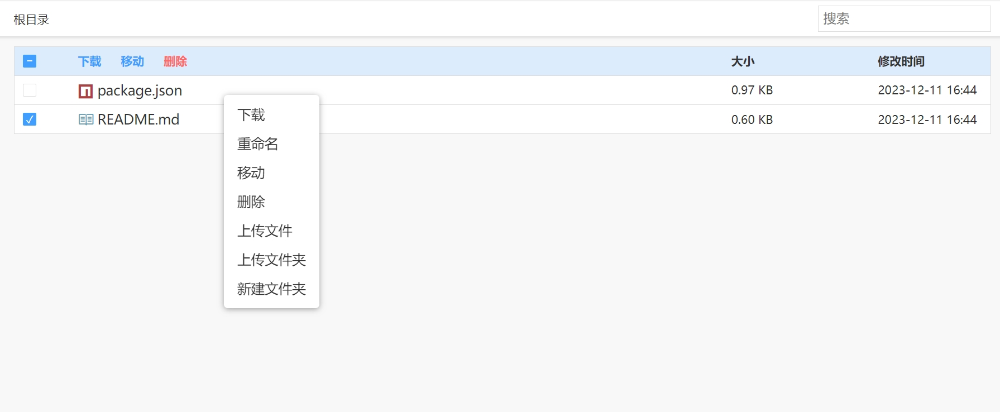

# disk

一个的简单云盘，可以用来局域网传输文件

- [x] 多文件上传
- [x] 文件夹上传
- [x] 文件下载和文件夹打包下载
- [x] 文件和文件夹删除
- [x] 重命名
- [x] 新建文件夹
- [x] 文件拖进文件夹
- [x] 图片、pdf、部分文本文件预览
- [ ] 文件移动

## 配置文件 config.json

```js
{
  "dest": "D:/html/release", // 根目录所在，绝对路径或相对路径
  "hasDel": true, // 是否能删除
  "port": 3000 // 端口
}
```

## 演示图


